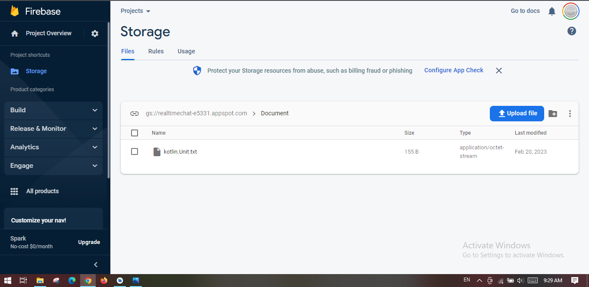
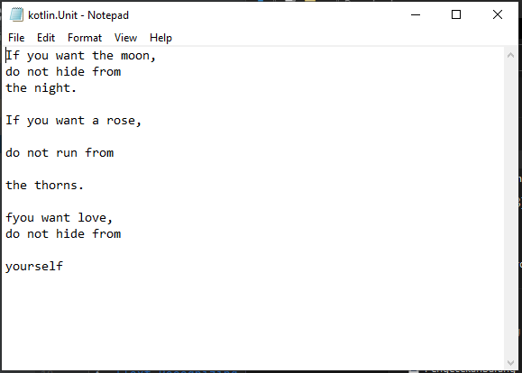

# Scan Text App

This application is a simple app for capture and coverted text on image. And also, uploaded converted text result on [Firebase Cluod Storage](https://firebase.google.com/docs/storage/android/start).

## Demo Video

[![Watch the video]](https://drive.google.com/file/d/1oslvflJKfjqjaNpZ_WGg6EDF8BpdyaY3/view?usp=share_link)

## Sample Image
Sample image that I use, [here](https://github.com/rofiqoff/scan-text/tree/master/Screenshots/sample.png)

## Firebase Storage Image

## Result

## Libraries
1. [CameraX](https://developer.android.com/training/camerax?hl=id) - to get captured image
2. [Firebase Storage](https://firebase.google.com/docs/storage/android/start) - to save result text on firebase storage
3. [Text Recognizing MLKit](https://developers.google.com/ml-kit/vision/text-recognition/android) - to read text from image
4. Glide - to show captured image from camera
